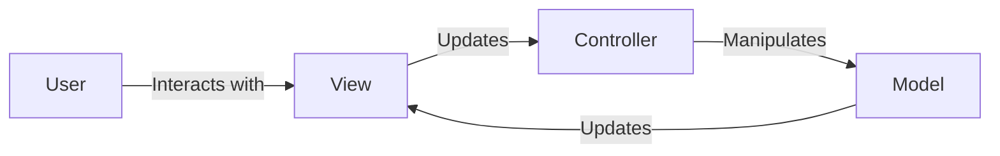

# REST API Notes

## Introduction to REST APIs
- **REST (Representational State Transfer)**: Architectural style for distributed systems.
- **APIs (Application Programming Interfaces)**: Set of rules for software applications to communicate.

## Key Principles of REST
1. **Client-Server Architecture**
   - Separation of concerns between client and server.
   - Enables independent development.

2. **Statelessness**
   - No client context is stored on the server.
   - Each request contains all necessary information.

3. **Cacheability**
   - Responses must indicate whether they can be cached or not.
   - Reduces server load and improves performance.

4. **Uniform Interface**
   - Consistent way to interact with resources.
   - Includes:
     - Resource identification (e.g., URIs)
     - Standard HTTP methods
     - Self-descriptive messages
     - Hypermedia links for navigation

5. **Layered System**
   - Supports scalability with intermediary servers like load balancers or proxies.

6. **Code on Demand (Optional)**
   - Servers can provide executable code to clients (e.g., JavaScript).

---

## HTTP Methods
| Method   | Description                          | Idempotent | Safe |
|----------|--------------------------------------|------------|------|
| **GET**  | Retrieve a resource                  | Yes        | Yes  |
| **POST** | Create a resource                    | No         | No   |
| **PUT**  | Update/replace a resource            | Yes        | No   |
| **DELETE** | Remove a resource                   | Yes        | No   |
| **PATCH** | Partially update a resource          | No         | No   |
| **HEAD**  | Retrieve metadata for a resource     | Yes        | Yes  |
| **OPTIONS** | Retrieve supported methods for a resource | Yes        | Yes  |

---

## HTTP Status Codes
| Code  | Category           | Description                             |
|-------|--------------------|-----------------------------------------|
| 200   | Success            | OK                                     |
| 201   | Success            | Created                                |
| 204   | Success            | No Content                             |
| 400   | Client Error       | Bad Request                            |
| 401   | Client Error       | Unauthorized                           |
| 403   | Client Error       | Forbidden                              |
| 404   | Client Error       | Not Found                              |
| 500   | Server Error       | Internal Server Error                  |
| 503   | Server Error       | Service Unavailable                    |

---

## RESTful Resource Naming
- Use nouns, not verbs (e.g., `/users`, not `/getUsers`).
- Use plural names (e.g., `/books`, `/authors`).
- Use lowercase letters and hyphens (e.g., `/order-items`).
- Include hierarchy (e.g., `/users/{id}/orders`).
- Filter and sort with query parameters (e.g., `/products?category=electronics&sort=price`).

---

## Example REST API Request
### Request (Create a New User)
```http
POST /users HTTP/1.1
Host: api.example.com
Content-Type: application/json

{
  "name": "John Doe",
  "email": "john.doe@example.com"
}
```
### Response
```http
HTTP/1.1 201 Created
Location: /users/123

{
  "id": 123,
  "name": "John Doe",
  "email": "john.doe@example.com"
}
```

---

## MVC Architecture
### Overview
- **MVC (Model-View-Controller)** is a design pattern used to separate an application into three interconnected components:
  - **Model**: Manages the data, logic, and rules of the application.
  - **View**: Displays data to the user and handles user interaction.
  - **Controller**: Acts as an intermediary between Model and View, processing user inputs and updating the model and view accordingly.

### Advantages of MVC
- Separation of concerns enables modularity.
- Facilitates testing and maintenance.
- Improves scalability of applications.

### Diagram


---

## Best Practices
1. **Use HTTP Methods Properly**
   - Match methods to actions (e.g., `GET` for reading, `POST` for creating).

2. **Provide Meaningful Status Codes**
   - Help clients understand the result of their requests.

3. **Use Pagination**
   - For large datasets, implement limit and offset (e.g., `/users?limit=10&offset=20`).

4. **Enable Filtering and Sorting**
   - Allow clients to filter and sort resources (e.g., `/products?price_lt=100&sort=price`).

5. **Secure the API**
   - Use HTTPS.
   - Implement authentication (e.g., OAuth2, API keys).
   - Validate all inputs.

6. **Document the API**
   - Use tools like Swagger or Postman for clear documentation.

---

## Tools for REST API Development
- **Postman**: Testing and documenting APIs.
- **Swagger/OpenAPI**: API design and documentation.
- **Insomnia**: Lightweight API client.
- **cURL**: Command-line tool for API testing.

---

## Additional Details
### REST API vs SOAP API
| Feature            | REST API                         | SOAP API                         |
|--------------------|-----------------------------------|-----------------------------------|
| Protocol           | HTTP                             | HTTP, SMTP, TCP, etc.            |
| Format             | JSON, XML, plain text, etc.      | Strictly XML                     |
| Stateless          | Yes                              | No                               |
| Performance        | High (lightweight)               | Comparatively lower              |
| Flexibility        | Highly flexible                  | Rigid                            |

### Blueprint for API Design
1. Identify resources (e.g., users, orders).
2. Define endpoints (e.g., `/users`, `/users/{id}`).
3. Choose appropriate HTTP methods.
4. Implement authentication and authorization.
5. Test thoroughly using tools like Postman.
6. Document the API with examples.

---

## References
- [RESTful API Tutorial](https://restfulapi.net/)
- [Postman Learning Center](https://learning.postman.com/)
- [Baeldung REST APIs](https://www.baeldung.com/)
